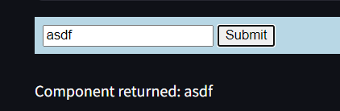

# Streamlined Custom Component for Streamlit

Easy way to create bidirectional components for streamlit with no backend setup, just some imports and html strings. Limited to html / css / javascript blocks.

## Installation
```bash
pip install streamlined_custom_component
```

## Usage

There are two main usecases:
(1) Simple: Overwrite a small portion of the boilerplate `index.html`.
(2) Complex: Overwrite the whole `index.html`.


## Simple usage

### Minimal example:
Below is a minimalist usage that gives a stylized submit field:

```
from streamlined_custom_component import create_component

input_id = 'test'
html_input = f"""
<input id="{input_id}" value="test" />
<button id="submit-button">Submit</button>
"""
java_script_input = """ 
console.log('Additional JavaScript');
"""
css_input = """
body { 
    background-color: lightblue; 
    }
"""

modifications = {
    "input_id": input_id,
    "html": html_input,
    "javascript": java_script_input,
    "css": css_input
}
my_component = create_component(component_name="custom_component1", modifications=modifications)
value = my_component()
st.write(f"Component returned: {value}")

# Display the value
print(value)
```


### Multiple components

You can make multiple instantiations of your custom component. Avoid the duplicate widget id error via passing different input variables names and component name:

```
  input_id2 = 'test2'
  html_input2 = f"""
  <input id="{input_id2}" value="test" />
  <button id="submit-button">Submit</button>
  """
  java_script_input2 = """ 
  console.log('Additional JavaScript ');
  """
  css_input2 = """
  body { 
      background-color: blue; 
      }
  """

  modifications2 = {
      "input_id": input_id2,
      "html": html_input2,
      "javascript": java_script_input2,
      "css": css_input2
  }
  my_component2 = create_component(component_name="custom_component2", modifications=modifications2)
  value2 = my_component2()
  st.write(f"Component returned: {value2}")

  # Display the value
  print(value2)
```

### Boilerplate html/css/javascript

Modifications like above add to the boilerplate html/css/javascript. Here it is for your reference:
```
default_html_template = """
<html>
  <head>
    <style>
    {css}
    </style>
  </head>
  <body>
    {html}

    <script>
      function sendMessageToStreamlitClient(type, data) {{
        var outData = Object.assign({{
          isStreamlitMessage: true,
          type: type,
        }}, data);
        window.parent.postMessage(outData, "*");
      }}

      function init() {{
        sendMessageToStreamlitClient("streamlit:componentReady", {{apiVersion: 1}});
      }}

      function setFrameHeight(height) {{
        sendMessageToStreamlitClient("streamlit:setFrameHeight", {{height: height}});
      }}

      function sendDataToPython(data) {{
        sendMessageToStreamlitClient("streamlit:setComponentValue", data);
      }}

      var myInput = document.getElementById("{input_id}");

      function onDataFromPython(event) {{
        if (event.data.type !== "streamlit:render") return;
        myInput.value = event.data.args.input_value;
      }}

      myInput.addEventListener("change", function() {{
        sendDataToPython({{
          value: myInput.value,
          dataType: "json",
        }});
      }})

      window.addEventListener("message", onDataFromPython);
      init();

      window.addEventListener("load", function() {{
        
        myInput.addEventListener("change", function() {{
          sendDataToPython({{
            value: myInput.value,
            dataType: "json",
          }});
        }});


        window.setTimeout(function() {{
          setFrameHeight(document.documentElement.clientHeight)
        }}, 0);
      }});

      setFrameHeight(0);

      {javascript}
    </script>
  </body>
</html>
"""
```

Modifications get added to the `{html}`, `{css}`, and `{javascript}` lines. 

## Complex usage
You can overwrite the entire boiler plate if you want and just pass a string via the `full_html` parameter:

```
# Overwrite the entire index.html
custom_html = """
<html>
  <body>
    <h1>Custom Component</h1>
    <input id="custom_input" value="" />
    <script>
      function sendMessageToStreamlitClient(type, data) {
        var outData = Object.assign({
          isStreamlitMessage: true,
          type: type,
        }, data);
        window.parent.postMessage(outData, "*");
      }

      function init() {
        sendMessageToStreamlitClient("streamlit:componentReady", {apiVersion: 1});
      }

      function setFrameHeight(height) {
        sendMessageToStreamlitClient("streamlit:setFrameHeight", {height: height});
      }

      function sendDataToPython(data) {
        sendMessageToStreamlitClient("streamlit:setComponentValue", data);
      }

      var myInput = document.getElementById("custom_input");

      function onDataFromPython(event) {
        if (event.data.type !== "streamlit:render") return;
        myInput.value = event.data.args.input_value;
      }

      myInput.addEventListener("change", function() {
        sendDataToPython({
          value: myInput.value,
          dataType: "json",
        });
      })

      window.addEventListener("message", onDataFromPython);
      init();

      window.addEventListener("load", function() {
        window.setTimeout(function() {
          setFrameHeight(document.documentElement.clientHeight)
        }, 0);
      });

      setFrameHeight(0);
    </script>
  </body>
</html>
"""
custom_component = create_component(full_html=custom_html, component_name="custom_component_full")
custom_value = custom_component(input_value="hello custom")
st.write(f"Custom component returned: {custom_value}")
```
